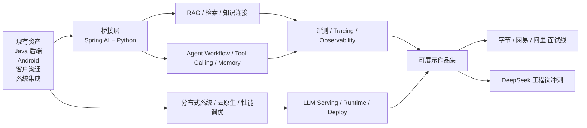
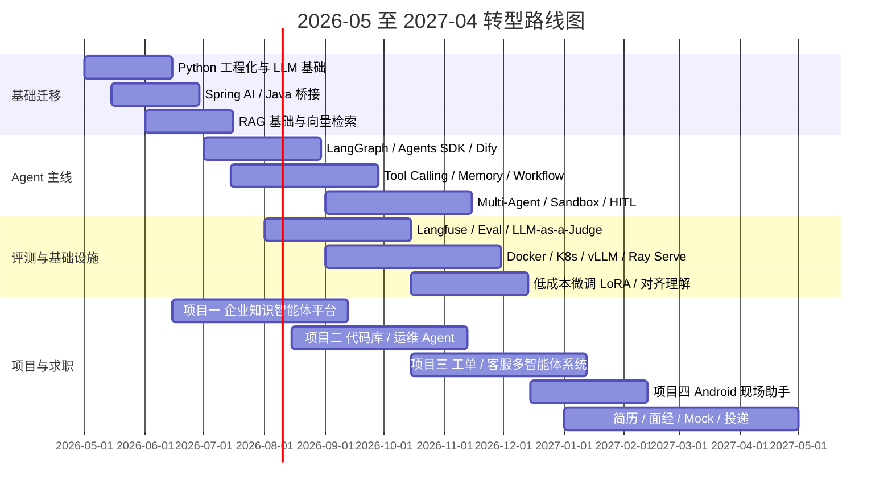

# 从 Java 工程师到大厂 Agent 开发工程师的转型研究

## 执行摘要

以你当前的履历看，这并不是一次“从零转 AI”，而更像一次“从企业级工程师升级为 AI Native 工程师”。你已经天然具备三类很难短期补齐的底层资产：稳定的 Java 服务端经验、真实客户沟通与需求澄清能力、跨系统集成与交付经验。公开岗位显示，字节、阿里、网易的大量 Agent 相关岗位，并不只招“会训模型的人”，而是在招能把模型、检索、工具、工作流、业务系统和交付链路接起来的工程师；DeepSeek 公开岗位也明显加强了 Agent 工程化、评测平台、运行时基础设施与 RL 基础设施联动的布局。citeturn33search0turn33search1turn49search1turn49search3turn14search4turn14search3turn45search7turn45search0

但你的最佳切入点，不是第一年就把主目标定为“纯模型研究员”或“强化学习算法研究员”。公开岗位里，字节 Seed 搜索 Agent 算法岗、网易有道 Agent 模型算法岗、阿里高级 AI Agent 专家岗、DeepSeek Agent 深度学习算法研究员/深度学习研究员等，都明显要求更强的 PyTorch、强化学习、对齐、论文/研究深度、甚至顶会成果；相比之下，数据智能体、开发者服务 Agent、AI Coding、游戏 AI 应用工程、全栈/Agent 平台、ToB 解决方案偏研发，更贴合你“工程 + 集成 + 业务抽象”的现有长板。citeturn33search4turn49search5turn24search1turn18search0turn34search6turn49search2

如果按 2026 年 5 月到 2027 年 4 月执行一轮高强度计划，你最现实的目标是：达到字节/阿里/网易的 Agent 应用开发、平台研发、AI Coding、解决方案偏研发岗位的面试线；DeepSeek 的工程型岗位可以作为冲刺目标；而纯研究型岗位在一年周期内更适合作为 stretch goal，而非主线目标。citeturn33search0turn33search6turn49search1turn49search3turn14search4turn24search1turn45search7turn45search0

这份报告的核心结论是：**你应该保留 Java 作为工程主栈，把 Python 变成 AI 主栈，把“客户沟通 + 系统集成”升级为“Agent 场景抽象 + Tool 编排 + 交付落地”，再用评测、可观测、RAG、Agent 工作流、云原生性能把自己补成一名生产级 Agent 工程师。** 对你而言，最优桥接技术不是先把 Java 丢掉，而是先用 Spring AI 延续既有企业栈，同时用 Python 构建 Agent 原型，再逐步走向多语言协同。Spring AI 官方就把目标定义为把企业数据与 API 连接到 AI 模型，而字节和阿里的工程岗也普遍同时接受 Java、Python、Go。citeturn39search6turn33search0turn14search4turn24search1

## 岗位画像与现实定位

本报告优先使用官方招聘页，其次是 entity["company","LinkedIn","professional network"]、entity["company","牛客网","job community"]、entity["company","BOSS直聘","job platform"]、entity["company","拉勾","job platform"] 与公开技术社区；技术原理优先采用原始论文与官方文档。对部分动态加载严重、搜索引擎无法完整抓取的官方页面，我用“官方职位标题/官方招聘页 + 公开抓取摘要/招聘镜像/技术社区转引”交叉验证。薪资仅在公开写明时填写；未见公开数字时，统一标注“未知”。citeturn48view0turn25search1turn45search6

从岗位本质看，这四家公司近三年的 Agent 岗可分为两条主线。第一条是**应用/平台工程线**：强调 Java/Python/Go、多系统对接、RAG、工作流、评测、云原生、性能与交付，这条线和你当前背景最贴近。第二条是**模型/算法研究线**：强调 PyTorch、SFT、DPO/GRPO、强化学习、多模态、训练与推理优化，通常对研究背景与算法深度要求更高。你的主线应该放在第一条，把第二条作为“补强理解和少量实战”的能力层，而不是第一年主攻。citeturn33search0turn33search6turn49search1turn49search3turn14search4turn14search3turn49search5turn24search1turn45search0turn18search0

| 项目 | 你的现状 | 与目标岗位的关系 | 结论 |
|---|---|---|---|
| 后端工程 | Java 服务端开发 | 是字节数据智能体、阿里 AI Agent/AI Coding、网易应用工程岗的直接基础 | **强项，应保留并升级** |
| 客户沟通 | 有真实客户交流经验 | 对字节解决方案架构师、网易游戏 AI toB、阿里云 Agent 场景落地特别加分 | **强项，应包装为“场景抽象与交付能力”** |
| 系统集成 | 做过多系统对接 | 直接映射到 Tool 编排、工作流、异构系统接入、企业知识连接 | **强项，是你的差异化优势** |
| Android 经验 | 写过 Android | 对移动端智能体、AI 客户端、现场服务助手、跨端体验有差异化价值 | **潜在亮点，建议做一个展示项目** |
| Python 生态 | 目前不是主力 | 几乎所有 AI/Agent 岗都把 Python 当成默认语言 | **核心短板，必须补齐** |
| LLM/Agent 工程 | 经验不足 | 岗位高频出现 RAG、Agent、Prompt、记忆、评测、MCP/工具调用 | **核心短板，必须系统化补齐** |
| 云原生与 AI 性能 | 可能有一般后端基础，但不一定深入到 GPU/LLM serving | 阿里、DeepSeek 尤其强调运行时、调度、K8s、推理服务 | **中高优先级短板** |
| 训练/微调/对齐 | 可能接近空白 | 对研究岗非常重要，对工程岗需要“懂并做过小规模实战” | **副主线能力，够用优先** |

对你最优的岗位排序，建议是：**Agent 应用开发工程师 / Agent 平台研发工程师 / AI Coding 工程师 / Agent 解决方案偏研发**，然后再冲击 **Agent 模型算法/搜索 Agent 算法**。不建议第一选择就是纯研究向深度学习研究员，因为公开岗位的门槛显著更高。citeturn33search6turn49search3turn14search4turn24search1turn45search7turn18search0

下面这张图是你的能力迁移关系图。它反映的不是“先学哪个框架”，而是“如何把原有资产迁移到大厂真正考察的 Agent 工程栈”。相关依赖关系来自官方文档里对 LangGraph、OpenAI Agents SDK、Spring AI、Langfuse 等能力边界的定义，也和岗位要求高度一致。citeturn36search0turn37search0turn37search1turn38search0turn39search6

## 四家公司近三年公开岗位要求

### 字节

| 岗位 | 公开时间 | 职责与必备/优先技能 | 经验/地点/薪资 | 来源 |
|---|---|---|---|---|
| 服务端开发工程师-数据智能体 | 2026 | 做 AI Native 数据智能产品；支持 Prompt Engineering、Multi-Agent、RAG；语言偏 Go/Java/Python；服务内部与 ToB 客户 | 社招；entity["city","上海","shanghai china"]；薪资未知 | 官方职位摘要 + 公开抓取摘要 citeturn1search0turn33search0 |
| AI Agent 研发实习生-开发者服务 | 2026 | 负责开发者服务团队 AI Agent 研发；要求硕士在读优先，熟悉 Python、LLM 原理、机器学习/深度学习；实习期 3 个月及以上 | 实习；entity["city","北京","beijing china"]；薪资未知 | 官方职位页 + 公开抓取摘要 citeturn33search3turn33search1 |
| 大语言模型 AI 搜索 Agent 算法工程师-Seed | 2025-2026 | 设计搜索总结 Agent；要求硕士及以上，熟悉 PyTorch/TensorFlow、RAG、Agent 架构、搜索算法、Prompt/对齐；岗位强调 CoT、多步推理与 RLHF/DPO | 校招；上海；校招薪资未知；相关 Top Seed 实习版公开为 300-1000 元/天 | 公开抓取摘要 + 牛客实习页 citeturn33search4turn33search2 |
| 高级 AI Agent 产品解决方案架构师-火山方舟 MaaS | 2026 | 挖掘高价值 Agent 场景；做 Context Engineering、State Management、Tool Orchestration、Memory 调优；要求 3 年以上架构/方案经验，至少 1 年专注大模型或 Agent | 中高级；entity["city","深圳","shenzhen china"]/杭州；薪资未知 | 领英公开岗位页 citeturn33search6 |

### 网易

| 岗位 | 公开时间 | 职责与必备/优先技能 | 经验/地点/薪资 | 来源 |
|---|---|---|---|---|
| 算法应用实习生-大模型应用方向 | 2025 | 负责算法应用项目和应用基础设施；要求熟悉 LangChain、LangGraph、Langfuse、Dify 等 Agent 框架；了解预训练、微调、部署等工程实施 | 实习；entity["city","广州","guangzhou china"]；薪资未知 | 公开抓取摘要 citeturn49search1 |
| 人工智能应用工程师（游戏 AI 方向）-实习生 | 2026 | 把 AI 赋能到游戏全链路并交付商业客户；要求 Python + 另一门语言（含 Java）、Linux/Shell、数据库、大数据平台、Docker/K8s、机器学习/强化学习经验 | 实习；entity["city","杭州","hangzhou zhejiang china"]；300-400 元/天 | 牛客公开岗位页 citeturn49search3 |
| AI 研究工程师（2026 届） | 2025 | 面向 LLM、多模态、游戏智能体等做研究与框架搭建；要求硕士及以上、C/C++ 与 Python、深度学习框架、项目落地与性能优化经验 | 校招/实习；广州/杭州/上海等；180-500 元/天 | 牛客公开岗位页 citeturn49search2 |
| Agent 模型算法工程师 | 2026 | 面向有道词典/词典笔等产品做 Agent 核心算法；要求精通 Python、PyTorch、LLM/SLM 训练与微调、SFT、PPO/GRPO/DPO、Plan-Execute、ReAct、Reflection、端侧低时延优化 | 社招；北京；薪资未知 | 公开抓取摘要 citeturn49search5 |

网易公示的方向非常“场景型”。官方伏羲页面展示了网易有灵智能体平台、AOP 面向智能体编程体系、ACE 高性能分布式引擎、群体智能与协作机制，说明它不只是做对话机器人，而是在游戏、工程机械、数据采标、人机协作等业务里做智能体平台化落地。对你来说，这意味着“懂业务流程、会做系统集成”的能力在网易特别值钱。citeturn25search1turn49search3

### 阿里

| 岗位 | 公开时间 | 职责与必备/优先技能 | 经验/地点/薪资 | 来源 |
|---|---|---|---|---|
| Qoder-AI Agent 研发工程师-AI Coding 方向 | 2025-2026 | 面向 AI Coding 做 Agent 研发；要求本科及以上、Python 为主，熟悉 Go/Java，理解 Transformer、LLM 微调/推理优化、多智能体、MCP/A2A/ANP 等协议与工程实践 | 社招；杭州；公开官方薪资未知；第三方整理为 40-70K | Qoder 官方招聘页 + 公开抓取摘要 + 第三方薪资整理 citeturn48view0turn14search7turn14search0 |
| AI Agent 开发工程师 | 2026 | 设计研发到运维场景的 Agent，强调分层规划、工具调用、自验证、自修正、技能结构化、效果评测与数据飞轮；要求掌握 Python/Java/Go/TS 之一，懂 Prompt、RAG、Agent、A2UI/AGUI | 实习；杭州；500-600 元/天 | 牛客公开岗位页 citeturn14search4 |
| AI Infra 开发工程师 / AI Agent 开发工程师 | 2026 | 做 Agent runtime、MicroVM 隔离、Scale-to-Zero、异构调度、Agent 生命周期平台；要求扎实算法/OS/数据结构，掌握 Java/Go/C++/Rust 中至少一门，了解提示词工程与 Agent | 实习；杭州；400-450 元/天 | 牛客公开岗位页 citeturn14search3 |
| 高级研发专家-AI Agent 方向 | 2026 | 做 AI Agent 框架设计与生产环境落地；要求 Python/Java/C++、TensorFlow/PyTorch、Spring AI、强化学习、多模态、Prompt、全链路数据合成/训练/评测，支持百万级应用 | 资深；北京；薪资未知 | 公开抓取摘要 citeturn24search1 |

阿里的关键词非常明确：**AI Coding、Agent runtime、可观测/运维、评测体系、云原生、百万级生产环境**。Qoder 官方招聘页还能看到 16+ 社招岗位、9+ 实习岗位，以及从 AI Agent 研发到 IDE 客户端、后端研发、Agent 产品经理的完整岗位链。对于你来说，阿里是最适合走“Java/后端 → Agent 平台/AI Coding 工程”的一家公司。citeturn48view0turn14search4turn14search3turn24search1

### DeepSeek

| 岗位 | 公开时间 | 职责与必备/优先技能 | 经验/地点/薪资 | 来源 |
|---|---|---|---|---|
| 全栈开发工程师 / 全栈工程师 | 2025 | 设计高吞吐、可伸缩的大模型应用；迭代智算平台界面；涉及分布式高性能计算、虚拟化、网络等基础设施；优先开源贡献与自驱能力 | 全职；杭州；薪资未知 | 领英公开岗位页 citeturn18search1turn34search8 |
| 数据百晓生（AGI） | 2025 | 做内容安全、数据集标准、标注平台、模型评估维度设计与应用 demo；强调大模型评测、数据规范、产品设计协同 | 全职；北京；薪资未知 | 领英公开岗位页 citeturn16search5turn34search7 |
| Agent 全栈开发工程师 | 2026 | 把外部 Agent 工具接进内部 RL 基础设施；维护 Agent 容器服务；搭建评测平台与轨迹查看/调试工具；对接 LangChain、OpenAI Agents SDK 等脚手架 | 社招；杭州/北京；薪资未知 | 公开抓取摘要 citeturn45search7 |
| Agent 深度学习算法研究员 / 智能体基础设施工程师等一组 Agent 岗位 | 2026 | DeepSeek 在 2026 年 3 月公开 17 个 Agent 相关岗位，覆盖算法研究、数据评测、基础设施；媒体报道指出多个岗位把 Claude Code、Cursor、Copilot 等 AI 编程工具重度使用写进优先条件；公开报道未披露薪资 | 公开岗位组；杭州/北京；薪资未知 | 量子位 + 商业周刊/新浪财经转引 citeturn45search0turn45search6 |
| 深度学习研究员 / 深度学习研发工程师 | 2025 | 研究与工程并重；要求能同时考虑训练、推理与部署，精通 Python/C++、PyTorch/TensorFlow，部分岗位偏论文与比赛成绩 | 全职；北京；薪资未知 | 领英公开岗位页 citeturn18search0turn34search6 |

DeepSeek 的岗位信号最鲜明的一点，是它对“**工程 + 研究混合型人才**”的偏好极强。公开报道显示，Agent 布局已经从基础模型研究转向产品化；公开面试经验也显示，它会按候选人的专业背景定制 coding 题，并进行长达 3 小时的高强度技术面。换句话说，DeepSeek 对工程岗都要求你不仅会搭系统，还要能解释为什么这么搭。citeturn45search0turn30view1

综合四家公司岗位画像，可以提炼出一个非常清晰的优先级：**Python 是通用门票，Java/Go 是工程岗强加分；RAG、Agent workflow、评测/可观测是面试高频公共语汇；云原生、运行时和性能在阿里/DeepSeek 更重，搜索/知识理解在字节更重，场景化和业务理解在网易更重。**citeturn33search0turn33search4turn49search1turn49search3turn49search5turn14search4turn14search3turn24search1turn45search7turn45search0

## 公开面试题库与评分要点

下面的题库分为四家公司。评分标准统一按 5 分制理解：**5 分**代表能给出结构化方案、明确 trade-off、指标与失败处理；**3 分**代表概念正确但工程细节不足；**1 分**代表只会背名词、落不到具体系统。DeepSeek 的公开真实面经相对少，因此我把来源明确标为“真实面经 / 公开题库 / 第三方面试指南”三类，避免把归纳题误写成真实题。citeturn30view0turn30view1turn31view0

### 字节

| 题型 | 代表题 | 参考作答要点 | 5 分答案特征 | 来源 |
|---|---|---|---|---|
| Agent 架构 | 如何实现 Agent 架构？ | 先拆 Planner、Executor、Tool Registry、Memory、Guardrail、Eval；区分单 Agent、Workflow、Multi-Agent；加入状态机、重试、幂等与可观测 | 能说明为什么不是所有场景都要 Multi-Agent，并给出成功率、工具调用准确率、p95、成本等指标 | 真实公开面经 citeturn23search4 |
| 工程难点 | 复杂 Agent 构建的 5 大挑战是什么？ | 不确定性放大、任务规划、工具调用可靠性、可观测/调试、成本与延迟；给出缓解手段 | 不只给概念，还能讲 Plan-and-Execute / ReAct、tool schema、trace、缓存、并行与超时 | 题目解析/面试稿 citeturn23search0 |
| 产品与评测 | 如何评估 AI 聊天产品好坏？如何搭评测体系？ | 分离模型层、工具层、任务层、产品层指标；做离线集、在线行为数据、LLM-as-a-judge 与人工抽检结合 | 能把“主观体验”转成可量化指标，如任务完成率、引用正确率、幻觉率、时延、留存 | 真实公开面经 citeturn23search3 |
| 长上下文 / 搜索 | 如何让大模型处理更长文本？ | 分 context budget、分块策略、检索、压缩、分层摘要、重排、引用约束、长文评测 | 能比较“长上下文直接喂”与“RAG + 压缩 + 分层检索”的成本/效果 trade-off | 真实公开面经 citeturn23search3 |
| 后端基础 | HashMap 原理、GC、AOP、Redis 分布式锁 | 回答 Java 基础实现、线程安全、回收器、代理机制、分布式锁 TTL 与原子性 | 能把“八股”与 Agent/后端生产环境接起来，例如为什么 tool 缓存依赖 Redis、为什么要关注 JVM 抖动 | 真实公开面经 citeturn23search2 |
| 算法题 | 最长回文子串 | 中心扩散法可快速过面；可加讲 Manacher 作为进阶 | 能说复杂度、边界条件，并现场写出可运行代码 | 真实公开面经 citeturn23search2 |

### 网易

| 题型 | 代表题 | 参考作答要点 | 5 分答案特征 | 来源 |
|---|---|---|---|---|
| RAG / 数据 | 如果想提高问答效果，应该从哪些方面做？ | 数据质量、索引策略、召回/重排、Prompt、引用、评测、用户反馈闭环 | 能把问题拆到“数据-检索-生成-评测-业务反馈”五层，而不是只说“换更强模型” | 真实公开面经 citeturn26search8 |
| 系统设计 | 对话场景中如何更好识别用户意图？可切换人格的问答系统如何设计？ | intent router、session state、persona config、安全边界、长期记忆与短期上下文隔离 | 能说明 persona 和任务能力不能混在一起，要做配置化和上下文治理 | 真实公开面经 citeturn26search8 |
| 对齐 / 强化学习 | 奖励模型怎么训练？奖励从哪里来？ | 偏好对、标注策略、reward model、pairwise ranking；区分 outcome reward 与 process reward | 能清楚讲偏好数据质量、reward hacking、为什么 reward 不等于业务正确性 | 真实公开面经 citeturn26search5 |
| RL 理论 | on-policy 和 off-policy 的区别与优缺点；为什么 SFT 和 RL 可能需要轮着来？ | 样本效率与稳定性 trade-off；SFT 提供格式和基本能力先验，RL 提升偏好/推理/策略 | 能联系到 LLM post-training，而不只背传统 RL 定义 | 真实公开面经 citeturn26search5 |
| 算法代码 | 零钱兑换 / 岛屿数量 | 动态规划或 DFS/BFS；强调状态定义、转移和复杂度 | 能边写边解释、处理边界并给出测试样例 | 真实公开面经 citeturn26search5turn26search9 |
| 行为 / 场景 | 最近了解哪些 AI 产品？怎么理解虚拟人/智能 NPC？为什么适合网易？ | 结合具体产品、游戏体验、AI 能力边界与用户体验答；说明自己如何把研发与内容场景连接 | 能从“玩法/用户旅程/可玩性/延迟/成本/安全”多个维度谈，而不是空泛说喜欢游戏 | 真实公开面经 citeturn26search4turn26search2 |

### 阿里

| 题型 | 代表题 | 参考作答要点 | 5 分答案特征 | 来源 |
|---|---|---|---|---|
| 项目深挖 | 详细介绍一下自己的 Agent 项目 | 把项目拆为任务定义、数据/知识、工具、路由、状态、评测、上线效果 | 不是“讲故事”，而是给出真实数据量、成功率、失败案例与改进迭代 | 真实公开面经 citeturn24search4 |
| 上下文工程 | 上下文超限怎么处理？系统提示词怎么设计？ | 做 context budget、检索压缩、滑动窗口、摘要、结构化提示、多层系统提示；约束输出 schema | 能明确哪些信息必须保留、哪些应该外部化到工具/知识库 | 真实公开面经 citeturn24search4 |
| 工具调用 | 有两个相似工具，如何保证准确调用？如果一件事要调十几个接口，怎么保证它完成？ | tool schema、tool ranking/router、参数校验、plan step、状态机、重试、补偿/回滚、人工兜底 | 能给出“规划—执行—验证”闭环，以及多接口任务的中间状态可观测方案 | 真实公开面经 citeturn24search4 |
| RAG / 搜索 | RAG 的整体链路？除了 MRR 还有哪些评价指标？ | chunk、embedding、hybrid retrieval、rerank、citation、faithfulness；指标看 Recall@k、nDCG、答案正确率、groundedness | 能区分检索指标与最终回答指标，并说明两者不总是同向 | 真实公开面经 citeturn24search6 |
| 模型选型 | 为什么选择某个模型，例如 DeepSeek V2.5？ | 从成本、时延、任务类型、工具调用、长上下文、部署方式、安全性比较 | 不是“它强”，而是能把业务约束转成模型选型标准 | 真实公开面经 citeturn24search6 |
| 工程基础 | ES 为什么用？分片高可用怎么做？为什么用 Kafka？ | 倒排与检索、分片副本、高可用、顺序 IO、异步解耦、削峰填谷 | 能把传统后端中间件和 Agent/RAG 链路穿起来讲 | 真实公开面经 citeturn24search6 |
| 编程笔试 | AI 研发岗笔试中的模拟、贪心、背包 DP | 保证基础算法不掉线，尤其是中等偏难题型 | 能在时限内抓核心状态与边界，别在工程岗忽视算法题 | 公开笔试整理 citeturn24search7 |

### DeepSeek

| 题型 | 代表题 | 参考作答要点 | 5 分答案特征 | 来源 |
|---|---|---|---|---|
| 模型架构 | 请简述 DeepSeek-V3 总体架构和主要创新点 | 讲 MoE、推理/训练效率、长上下文、训练与服务成本优化、和 R1 的关系 | 能从能力、效率、工程代价三维解释，不只背名词 | 公开高频题库 citeturn30view0 |
| 注意力机制 | MLA 的核心原理是什么？如何通过低秩压缩降低 KV cache？ | 说明 latent compression、KV cache 压缩、长上下文与吞吐的好处和代价 | 能把“为什么降低显存/内存占用”讲清，并能说出对质量的权衡 | 公开高频题库 citeturn30view0turn29search4 |
| 强化学习 / 对齐 | 请解释 DeepSeek-R1-Zero 的纯 RL 流程，以及 GRPO 的作用 | 从 group relative reward、参考策略约束、冷启动数据、R1 多阶段训练讲起 | 能把 GRPO 与传统 RLHF/PPO 的差别讲明白，并联系可读性/语言一致性问题 | 公开高频题库 + R1 论文 citeturn30view0turn41search1 |
| 对齐理论 | DPO 为什么用 KL 散度，不用交叉熵？什么时候必须用 KL、什么时候可互换？ | 交叉熵更偏 token-level supervised target；DPO处理成对偏好；KL 用于对 reference policy 做偏离约束 | 能从目标函数、偏好学习场景和训练稳定性解释，而不是死记定义 | 真实面试报道 citeturn30view1 |
| 工程系统设计 | 你要做一个 DeepSeek 风格的代码助手，为 monorepo 做 RAG，如何 chunk/index？首要失败模式是什么？ | 代码按 symbol/function/class 切、文档按 section 切；加 path/module metadata；关注 grounding、跨文件依赖、低时延 | 能说出离线评测集和 failure mode，而不是只会“切块 + 向量库” | 第三方面试指南 citeturn31view0turn31view1 |
| 评测 / Trade-off | 在 300ms p95 预算下，你选 cross-encoder reranker 还是 LLM verification？如何量化取舍？ | 先定义离线指标与开发者 outcome，再按时延预算选链路；说明 rerank、verification 各自更适合的失败模式 | 能做 latency-budgeted design，而不是泛泛而谈“都上” | 第三方面试指南 citeturn31view0 |
| 编程与面试形式 | 根据专业背景定制 coding 题；技术面长达 3 小时 | 准备“算法 + 数学/ML + 工程系统 + 项目推演”四合一面试方式 | 能在长时间高压下保持结构化表达与现场推导 | 真实面试报道 citeturn30view1 |

从这些面试题可以看出一个重要现实：**大厂 Agent 面试并不是“加一点大模型八股”，而是“AI 原理 + 检索/评测 + 后端工程 + 系统设计 + 算法代码 + 项目真实性”的复合拷打。** 这也解释了为什么你的 Java/系统集成背景不是包袱，反而是可被放大的底座。citeturn23search2turn23search3turn24search4turn24search6turn26search8turn26search5turn30view1turn31view0

## 关键知识与能力维度

从岗位要求与面试题反推，你需要的并不是“学会几个流行框架”，而是一棵完整的能力树：**模型理解 → RAG/检索 → Agent 编排 → 评测/可观测 → 基础设施/运行时 → 业务系统集成**。这棵树的底层支撑来自 RAG、ReAct、LangGraph、LangChain、OpenAI Agents SDK、AutoGen、LlamaIndex、Dify、Langfuse、Spring AI、vLLM、Ray Serve 以及 DeepSeek-R1、LoRA 等论文/官方文档。citeturn35search3turn35search0turn36search0turn36search5turn37search0turn37search1turn37search11turn39search0turn39search1turn38search0turn39search6turn38search5turn38search3turn41search1turn41search5

| 能力维度 | 入门 | 熟练 | 专家 | 代表评估指标 |
|---|---|---|---|---|
| Python / Java / Go 多语言协同 | 能用 Python 写 tool-calling demo；能把 Java 服务暴露给 Python Agent 调用 | 能做 Java 主系统 + Python Agent Sidecar；懂 REST/gRPC/异步消息联动 | 能设计多语言 Agent 平台、统一 schema、统一 tracing 与版本治理 | 单项目内完成 Java + Python 联调；接口契约稳定；关键模块测试覆盖率 ≥ 70% |
| LLM 基础与上下文工程 | 理解 Transformer、token、temperature、few-shot、structured output | 能做 prompt 分层、context budget、引用约束、tool schema 设计 | 能系统比较 prompt、模型、工具、记忆、压缩策略，并形成评测闭环 | 任务完成率、结构化输出合规率、幻觉率、token 成本 |
| RAG 与检索 | 会做 embedding、chunk、向量检索 | 会做 hybrid retrieval、metadata filter、rerank、query rewrite | 会做多索引、分层检索、长文压缩、citation-grounded answers、离线/在线 eval | Recall@k、nDCG、groundedness、faithfulness、首字节时延 |
| Agent 工作流与多智能体 | 会做 ReAct/Plan-Execute 单 Agent | 会设计 router、memory、tool retry、human-in-the-loop、子任务编排 | 会做多 Agent 协作、长任务状态恢复、sandbox、skill library、workflow governance | 任务成功率、平均步数、工具成功率、回滚率、p95 时延 |
| 评测与可观测 | 会打日志、做基础测试集 | 会用 tracing、LLM-as-a-judge、轨迹评测、用户反馈回流 | 会做线上/线下统一评测体系、A/B、root-cause 分析、质量门禁 | 路由准确率、trajectory score、人工抽检一致率、线上回退率 |
| 微调与对齐 | 懂 SFT、LoRA、DPO/GRPO 的概念 | 能自己做一个小规模 SFT/LoRA 项目并有基准对比 | 能做偏好数据设计、蒸馏、压缩、低时延场景优化，并能解释 trade-off | 基准集提升、资源成本、收敛稳定性、部署后效果一致性 |
| 云原生 / 性能 / Serving | 会 Docker、Linux、Redis、MQ | 会 K8s、CI/CD、模型服务部署、缓存、并发控制 | 会多节点 serving、自动伸缩、GPU 利用、故障恢复、观测体系 | p95/p99、吞吐、GPU 利用率、SLO 达成率、成本/请求 |
| 业务抽象与交付 | 能把需求写成工具/API 列表与流程图 | 能把客户需求抽象成 Agent workflow 与业务指标 | 能做方案评审、ROI 解释、灰度上线与组织协同，成为研发型解决方案负责人 | PRD 质量、方案评审通过率、业务指标改进、客户/用研反馈 |

如果按公司偏好再细分，字节更强调搜索/数据/开发者服务与 context engineering；网易更强调场景、游戏、交互、用户体验与部分 RL；阿里更强调 AI Coding、Agent runtime、可观测和云原生；DeepSeek 更强调研究驱动下的工程化、评测平台、RL 基础设施与高性能系统。citeturn33search4turn33search6turn25search1turn49search5turn48view0turn24search1turn45search0turn45search7

## 一年学习与实践路线图

这条路线按 **2026 年 5 月到 2027 年 4 月** 设计。它故意把“评测与可观测”前置，而不是最后补，因为 LangGraph、OpenAI Agents SDK、Langfuse 以及专门的 Agent 评测课程都把 tracing/evals 视为生产级智能体的基础设施，而不是锦上添花。citeturn36search0turn37search0turn37search1turn38search0turn50search0turn50search2turn50search6

### 月度计划

| 月份 | 学习主线 | 必做产出 | 过关标准 |
|---|---|---|---|
| 2026-05 | Python 工程化、LLM 基础、Spring AI 入门 | 用 Python 写一个 tool-calling demo；用 Spring AI 接一个基础聊天/嵌入服务 | Python 不再停留在脚本级；能独立写清晰项目结构 |
| 2026-06 | RAG 基础、向量库、混合检索 | 完成项目一 Alpha：企业知识问答原型 | 能解释 chunking、embedding、BM25/向量检索差异 |
| 2026-07 | LangGraph / OpenAI Agents SDK、Agent 循环 | 项目一 Beta：加入工具调用、引用、trace | 能画出单 Agent 工作流图并讲清失败重试 |
| 2026-08 | 评测与可观测、Langfuse、数据集构建 | 项目一 Release；项目二 Alpha 开工 | 有一套最小离线评测集；trace 可复盘 |
| 2026-09 | Docker、K8s、vLLM、服务化部署 | 项目二 Beta：代码库/运维 Agent 可部署 | 能量化 p95、吞吐、成本，不再只是“能跑” |
| 2026-10 | LoRA / SFT / DPO/GRPO 理解与小实战 | 跑通一个小模型 LoRA 微调实验；项目三 Alpha | 能说清 SFT/LoRA/DPO/GRPO 的边界，不要求研究级实现 |
| 2026-11 | Multi-Agent、sandbox、权限边界、安全 | 项目三 Beta：加入人工兜底、补偿、权限控制 | 能解释什么时候需要多智能体，什么时候不需要 |
| 2026-12 | ToB 场景化、工单/客服/集成、Android 差异化 | 项目三 Release；项目四 Alpha | 能把真实客户/系统集成经验迁移进 AI 项目叙事 |
| 2027-01 | 简历改造、面试题第一轮系统刷题 | 完成一版 AI 工程师简历与作品集主页 | 简历能围绕“Agent 工程化”而非“Java 八股”叙事 |
| 2027-02 | Mock Interview、算法题、系统设计 | 完成 4 次模拟面试、40-60 题算法专项 | 能在 45 分钟内讲完一个 Agent 项目且经得起追问 |
| 2027-03 | 定向投递字节/网易/阿里，冲刺 DeepSeek | 项目打磨、案例 deck、开源贡献 | 有至少 1 个可公开演示项目 + 1 个技术文章/PR |
| 2027-04 | 复盘与迭代 | 根据面试反馈补短板 | 面试官评价不再卡在“你只是 Java 工程师” |

### 必做项目建议

| 项目 | 目标与价值 | 推荐技术栈 | 关键里程碑 | 评估标准 | 面试演示要点 |
|---|---|---|---|---|---|
| 企业知识智能体平台 | 用你熟悉的企业场景切入，把“客户沟通 + 系统集成”迁移为“知识连接 + Tool 编排 + 引用问答” | Java/Spring Boot + Spring AI、Python/FastAPI、LangGraph、pgvector 或 Milvus、Elasticsearch、Redis、Langfuse、Docker/K8s | 文档 ingestion → hybrid retrieval → 引用回答 → tool calling → trace/eval → 部署 | Recall@10、grounded answer rate、p95、单请求成本 | 架构图、数据流、检索指标、失败案例与优化前后对比 |
| 代码库 / 运维 Agent | 对标字节开发者服务与阿里 AI Coding 场景，做 repo RAG、issue triage、日志分析、脚本执行 | Python、OpenAI Agents SDK、Tree-sitter/JGit、Redis、GitHub API、本地 sandbox、Langfuse | repo index → bug triage → log/tool calling → 计划执行 → 验证环节 | 问答准确率、工具成功率、修复建议命中率、验证通过率 | 为什么需要计划-执行-验证；如何防止错误 patch；如何做权限隔离 |
| 工单 / 客服多智能体系统 | 强化你“与客户沟通 + 多系统对接”的护城河，做真实 ToB 交付味道的多 Agent 项目 | Dify 或 LangGraph、Spring Boot、MySQL、Kafka、CRM/工单 mock、权限系统、Langfuse | 路由 Agent → 知识 Agent → 操作 Agent → 人工审批 → 结果回写 | route accuracy、工单闭环率、人工接管率、平均处理时长 | 为什么不是一个大 Agent 解决一切；如何做人工兜底与补偿 |
| Android 现场服务助手 | 把你少有的 Android 经验变成差异化标签，做移动端现场排障/知识辅助 | Android/Kotlin、Spring AI 后端、OCR/语音输入可选、离线缓存、RAG | 移动端 UI → 离线索引缓存 → 现场问答 → 工具调用 → 数据回流 | 崩溃率、离线命中率、端到端时延、用户任务完成时间 | 为什么你的 Android 背景比纯 Python 候选人更值钱；如何做端云协同 |

一年后能不能过一线大厂，不看你学了多少课程，而看你是否能拿出下面这些“证据”：

| 证据 | 最低标准 |
|---|---|
| 可展示项目 | 至少 3 个，其中 2 个必须有真实 trace/eval/指标 |
| 开源/公开痕迹 | 至少 1 个 PR、Issue、插件、模板或技术文章 |
| 工程深度 | 至少 1 个项目能讲部署、缓存、并发、权限、监控、回滚 |
| AI 深度 | 至少 1 个项目能讲 RAG + Agent + Eval 全链路 |
| 算法基础 | 刷完约 80 道高频题，覆盖 DP、图、字符串、搜索、数据结构 |
| 模拟面试 | 至少 8-10 次，其中技术面 6 次以上 |

## 简历与面试策略

公开面经显示，面试官会不断把你的项目往“真实数据、指标、工具调用准确率、上下文预算、ES/Kafka/Redis、Prompt 为什么这么写、为什么这个模型、失败怎么兜底”方向深挖。也就是说，你的简历不能再写成“做过几个 Java 项目”，而要写成“做过多系统连接、多角色协作、有业务结果约束的智能工作流系统”。citeturn23search2turn24search4turn24search6turn26search8turn31view0

### 简历重写建议

| 现有经历 | 在简历里的新表达方式 | 为什么有效 |
|---|---|---|
| Java 服务端开发 | “具备高并发业务系统设计与服务治理经验，可将 Agent 能力接入现有微服务体系” | 让面试官第一眼看到“工程底座” |
| 客户沟通 | “具备客户需求澄清、流程抽象与方案落地能力，可把模糊需求转化为 Agent workflow 与工具边界” | 这是很多纯算法候选人欠缺的能力 |
| 系统集成 | “有跨系统 API/消息/权限/数据流集成经验，适合 Tool 调用与企业知识连接场景” | 直接映射到 Agent 工程化 |
| Android | “具备端侧产品与移动交互经验，可做端云协同、现场助手、移动智能体客户端” | 形成差异化标签 |
| 新项目 | 每个项目必须写：目标场景、技术栈、关键难点、量化指标、失败与优化 | 这比“负责 xx 模块开发”更像大厂 AI 简历 |

简历中最值得突出的一类句式，不是“我学习了 LangChain/LangGraph”，而是“**把某个真实业务流程重构成了可观测、可评测、可回滚的 Agent 工作流**”。因为岗位需求和面经都在证明，公司更想要的是能落地的人。citeturn33search6turn49search3turn14search4turn45search7

### 常见行为面试问题与回答要点

| 问题 | 回答框架 | 高分要点 |
|---|---|---|
| 为什么从 Java/Android 转到 Agent 开发？ | 过去做的是“确定性系统开发”，现在升级为“模型 + 工具 + 工作流 + 业务闭环开发” | 强调不是放弃工程，而是把工程能力升级到 AI Native |
| 你最大的优势是什么？ | 企业级工程经验、系统集成、客户沟通、真实交付 | 不说“学习能力强”这种空话，要给案例 |
| 讲一个你处理模糊需求的例子 | STAR：场景、目标、冲突、拆解方法、结果 | 重点说你如何把模糊需求转为接口、状态流与验收指标 |
| 讲一个线上问题/失败案例 | 问题发现、根因定位、修复、复盘、机制化预防 | 最忌只说“最后解决了”，高分在于复盘机制 |
| 如何说服业务接受 Agent 不一定 100% 正确？ | 从灰度、人工兜底、风险分级、价值评估、回退机制谈 | 体现工程治理与业务理解 |
| 你最想加入哪类团队？ | 开发者服务 / AI Coding / 企业智能化 / 场景 Agent | 与你的项目和经验强绑定，别泛泛说“贵司平台好” |

### 模拟面试评分表

| 维度 | 权重 | 通关线 | 观察点 |
|---|---:|---:|---|
| 项目真实性与深挖抗压 | 25% | 18/25 | 数据量、失败案例、指标、权衡是否真实 |
| Agent 工程化设计 | 20% | 14/20 | Workflow、Tool、Memory、Guardrail、Eval 是否完整 |
| RAG / 检索 / 上下文工程 | 15% | 10/15 | 是否只会“向量库 + Prompt” |
| 云原生 / 性能 / 基础设施 | 10% | 6/10 | 部署、缓存、并发、时延、回滚 |
| 算法与编码 | 15% | 10/15 | 中等题是否稳定，复杂度是否清晰 |
| 沟通表达 | 10% | 7/10 | 是否结构化、能否在高压下清楚作答 |
| 行为与 owner 意识 | 5% | 3/5 | 是否有推动、复盘、协同意识 |

一套比较现实的标准是：**Mock 总分 75+ 才开始大规模投递；60-75 之间只做小范围试投；60 以下继续补项目与表达。**

## 资源清单与资料缺口

### 推荐学习资源

资源排序遵循一个原则：**先官方文档和原始论文，再能提升实战与面试命中率的课程/题库，最后再补系统书。** 因为你的目标不是做学术综述，而是在一年内形成“能被面出来”的能力。citeturn36search0turn37search0turn38search0turn39search6turn41search1turn50search0turn50search6

| 优先级 | 资源 | 类型 | 语言 | 为什么推荐 | 来源 |
|---|---|---|---|---|---|
| P0 | Spring AI 官方文档 | 官方文档 | 英文 | 最适合你从 Java 企业栈桥接到 AI 工程 | citeturn39search6 |
| P0 | LangGraph overview | 官方文档 | 英文 | 用于学习长任务、状态、记忆、人工介入、durable execution | citeturn36search0turn36search2 |
| P0 | OpenAI Agents SDK | 官方文档 | 英文 | 学 tools、handoff、trace、sandbox 与生产级 harness | citeturn37search0turn37search1turn37search2 |
| P0 | Langfuse Overview | 官方文档 | 英文 | 把 tracing、prompt、evaluation 前置到工程主线 | citeturn38search0turn38search1 |
| P0 | RAG 论文 | 论文 | 英文 | 构建检索增强生成的理论基座 | citeturn35search3turn35search4 |
| P0 | ReAct 论文 | 论文 | 英文 | 理解 reasoning + acting 的经典 Agent 范式 | citeturn35search0turn35search1 |
| P1 | LlamaIndex 官方文档 | 官方文档 | 英文 | 学数据连接、索引、query engine、workflows | citeturn39search0 |
| P1 | Dify 官方文档 | 官方文档 | 英文 | 快速做可演示的 agentic workflow 平台项目 | citeturn39search1turn39search7turn39search10 |
| P1 | AutoGen 官方文档 | 官方文档 | 英文 | 学多智能体消息协作与职责分拆 | citeturn37search4turn37search11 |
| P1 | vLLM 官方文档 | 官方文档 | 英文 | 学高吞吐、低内存浪费的 LLM Serving | citeturn38search5turn38search2 |
| P1 | Ray Serve LLM 文档 | 官方文档 | 英文 | 学多节点部署、自动伸缩、OpenAI 兼容 serving | citeturn38search3 |
| P1 | LoRA 论文 | 论文 | 英文 | 作为微调/适配入门最合适 | citeturn41search5 |
| P1 | DeepSeek-R1 论文 | 论文 | 英文 | 用于补齐 reasoning、RL、GRPO 的理解深度 | citeturn41search1 |
| P1 | 牛客阿里云面经 / 大模型面经话题 | 题库/面经 | 中文 | 高频、更新快、贴近真实问法 | citeturn24search4turn26search9 |
| P2 | Agentic AI | 课程 | 英文 | 用原始 Python 学 reflection、planning、multi-agent | citeturn50search6turn50search5 |
| P2 | Evaluating AI Agents | 课程 | 英文 | 系统学 agent eval、tracing、LLM-as-a-judge | citeturn50search0 |
| P2 | LangChain Academy | 课程 | 英文 | 适合补 observability 与 eval 的体系化训练 | citeturn50search2 |
| P2 | Prompt engineering overview | 官方文档 | 英文 | 不是为了背提示词，而是形成实验与 success criteria 意识 | citeturn50search3 |
| P2 | Designing Data-Intensive Applications, 2nd Ed. | 书 | 英文 | 提升分布式系统与数据系统判断力 | citeturn46search9turn46search0 |
| P2 | Kubernetes: Up and Running | 书 | 英文 | 补云原生与部署视角 | citeturn46search2 |
| P2 | Deep Learning: Foundations and Concepts | 书 | 英文 | 作为深度学习系统入门读物比碎片化视频更稳 | citeturn46search5 |

### 公开资料缺口与已检索情况

| 公司 | 未公开 / 未找到的关键项 | 已检索来源 | 已检索关键词 |
|---|---|---|---|
| 字节 | 多数社招岗位的官方详情页文本抓取不完整；公开薪资多未披露 | 官方职位页、公开抓取摘要、牛客、领英 | `字节 智能体 招聘`、`AI Agent 开发者服务 字节`、`AI 搜索 Agent Seed` citeturn33search0turn33search1turn33search4turn33search6 |
| 网易 | 官方校园/社招页搜索索引弱，很多岗位全文依赖第三方平台可见；部分岗位薪资缺失 | 伏羲官网、牛客、面试马 | `网易 伏羲 Agent 招聘`、`网易 大模型应用 工程师`、`网易 智能体 方向` citeturn25search1turn49search1turn49search3turn49search5 |
| 阿里 | 部分 careers 详情页可见标题但全文难稳定抓取；高级岗薪资多未公开 | Qoder 官方招聘页、牛客、面试马 | `阿里 AI Agent 招聘`、`Qoder AI Agent`、`阿里云 AI Agent 开发工程师` citeturn48view0turn14search4turn14search3turn24search1 |
| DeepSeek | 2026 Agent 岗官方详情页未稳定机器可读；薪资公开极少；真实工程面经远少于其他三家 | 领英、量子位、商业周刊/新浪财经转引、面试马、DeepSeek 技术社区 | `DeepSeek Agent 全栈开发工程师`、`DeepSeek Agent 深度学习算法研究员`、`DeepSeek 面试` citeturn18search1turn45search0turn45search6turn45search7turn30view1turn30view0 |

最终落点很明确：**你不需要把自己重塑成“论文型算法研究员”，而是要把自己升级成“能把模型接入真实系统、能把模糊业务需求变成可评测工作流、还能把系统跑稳”的 Agent 工程师。** 在这条路径上，你过去的 Java、Android、客户沟通、系统集成经验不是历史包袱，而是你区别于一大批纯 Python 初级转型者的核心筹码。只要这一年把 Python、Agent 工程化、评测与云原生补齐，你对字节、网易、阿里的应用/平台线岗位是有现实竞争力的；对 DeepSeek，则应把它当作更高门槛的冲刺目标。citeturn33search0turn49search3turn14search4turn45search7turn30view1